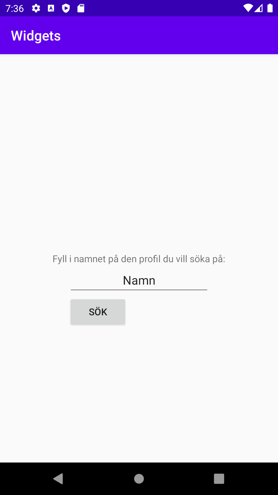
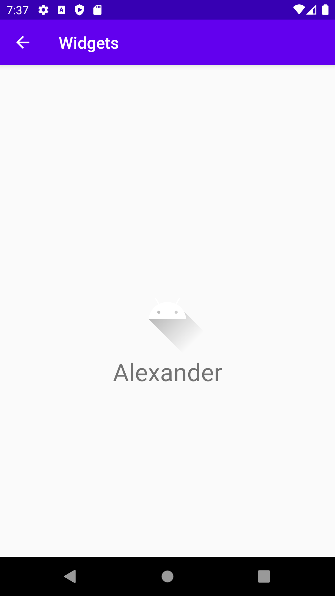

# Assignment 3: Widgets (Rapport)

## Startsida:

När applikationen startas visas ett fält där användaren kan skriva in ett namn och sedan klicka på en sök knapp. Detta är två olika widgets som
är inlagda i XML filen layout, dessa har sedan egen styling och id som syns i bild nedan. När man klickar på denna knapp triggas en
eventlistner som i sin tur skapar en intent, denna packar ihop texten från _EditText_ fältet, sedan skickas allt detta till nästa
intent som är profil sidan, koden för detta syns nedan.



```
// Kopplar variabler mot widgets
Button search = findViewById(R.id.search_button);
whatToSearchFor = findViewById(R.id.input_name);

search.setOnClickListener(new View.OnClickListener() { // Listner för sök knapp
    @Override
    public void onClick(View view) {
        Intent intent = new Intent(MainActivity.this, ProfilePage.class); // Skapar intent till profilsida
        whatToSearchForString = whatToSearchFor.getText().toString(); // Ger variabeln texten från EditText fält

        // Startar intent och skickar med extras datan
        intent.putExtra("name", whatToSearchForString);
        startActivity(intent);
    }
});
```

## Profilsida:

Efter detta kommer man till profil sidan. Så fort den öppnas (skapas) så sätts texten för text rutan till det värdet som skickas med
från tidigare intent, detta görs genom en bundle som syns i kod nedan. Slutligen sätts även bilden för profilbilden.



```
// Kopplar variabler mot widgets
TextView person = findViewById(R.id.person_field);
ImageView ProfilePicture = findViewById(R.id.imageView);

Bundle extras = getIntent().getExtras(); // Skapar bundle med tidigare extras från intent
// Om det finns ett värde i extras (bundle) blir detta värdet för TextView
if (extras != null) {
    String name = extras.getString("name");
    person.setText(name);
}

// Sätter profilbilden för ImageView widgeten
ProfilePicture.setImageResource(R.drawable.ic_launcher_foreground);
```